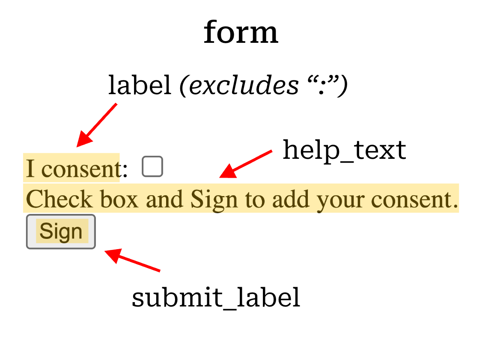
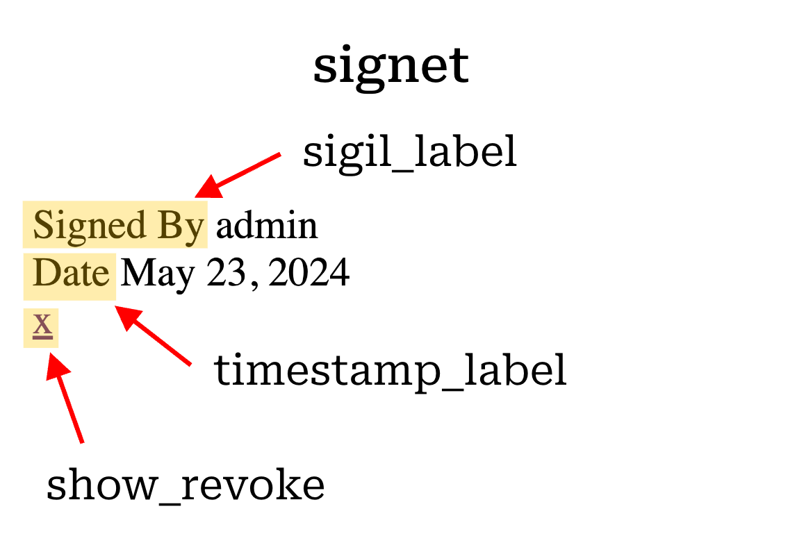

# Rendered Text
To customize the text displayed in a signoff form or signet, pass the desired text to the appropriate parameters when 
registering your signoff. You can also pass these parameters as keyword arguments to the `render_signoff` template tag. 
Refer to the diagrams below the code for guidance.

```{code-block} python
# Registering a signoff with custom text
arbitrary_signoff = SimpleSignoff.register(
	id='arbitrary_signoff',
	sigil_label='Signed by',
	render=SignoffRenderer(
		form_context=dict(
			help_text='Check box and Sign to add your consent',
			label='I consent',
			),
		signet_context=dict(
			timestamp_label='Date',
			show_revoke=True,
			with_signature_line=False,
			signature_line_label='Signature'
        ),
    ),
)
```

```{code-block} html
<!-- Rendering a signoff with custom text in a template -->
<div class="signoffs">
    
</div>
```

```{WARNING}
The `sigil_label` is rendered from the signoff itself, not from the `signet_context`, thus if it's changed, the change 
will be reflected at the DB level in the signet
```
```{subfigure} AB
:layout-sm: A|B
:gap: 8px
:subcaptions: above
:name: rendered_examples
:class-grid: outline


    
 
```
